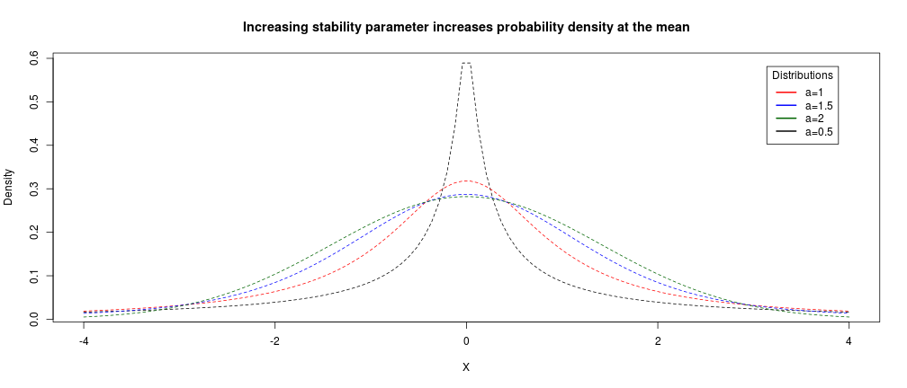

## Outline of Talk

- Bayesian Inference and Phylogenetics
- Model Selection Criteria: DIC, PBIC, PSRF
- Brownian Motion vs the "Stable"" Model
- Hands-On Work with SimpleTraits

--- .class #id 

## Before we begin:


```r
# Set seed for reproducibility
set.seed(123)
# Tidyverse, for dataframe data wrangling
library(tidyverse)
# StableDist, for the Stable Distribution
library(stabledist)
# ggtree, to visualize the tree (also conveniently imports everything else we may need to manipulate the trees)
library(ggtree)
```

--- .class #id 

## Bayesian Inference and Phylogenetics

--- .class #id

## Frequentists vs Bayesians

Paradigm of Frequentist Statistics:  
  - Results of a single experiment draw from the same infinite pool of probable results of equivalent experiments  
  - Analysis of results, criteria for significance, must be concurrent with experimental design to avoid bias  

The alternate view of Bayesian Statistics:  
  - Each experiment draws inherently from our a priori knowledge  
  - One can/must incorportate these a priori data into the a posteriori analysis (caveat: Objective vs Subjective Bayesians)  

--- .class #id 

## Why Bayes?

  - Maximum Likelihood via nonparametric bootstrapping is computationally taxing for large trees  
  - Bayesian methods don't necessarily rely on fixed parameters, and can treat model parameters as random variables  
  - Using MCMC with Bayes not only speeds up search through parameter space, but also makes calculations easier  
  - Intuitive interpretation of posterior probabilities as conditional on data
  - Sometimes ML is simply intracible, and Bayesian methods are needed to solve numerically

--- .class #id 

## Intro to Bayes's Law

Recall that given our parameters $\theta$, and our data $D$, the probability of our parameters given the data is given by:  
 
$$ P(\theta|D) = \frac{P(\theta)P(D|\theta)}{P(D)} $$


--- .class #id 

## Intro to Bayes's Law: Priors

Recall that given our parameters $\theta$, and our data $D$, the probability of our parameters given the data is given by:  
$$ P(\theta|D) = \frac{\boldsymbol{P(\theta)}P(D|\theta)}{P(D)} $$  

$\boldsymbol{P(\theta)}$ is known our *prior*, and represents our _a priori_ notions of what the probability of our parameters are.

--- .class #id 

## How to pick your prior

Your prior will be a distribution selected based on your prior notions of the reality of the situation

Done right, the nitty-gritty details of your prior actually shouldn't matter too much!

How so?

--- .class #id 

## How to pick your prior

Consider this form of Bayes Law:

$$ P(\theta|D) \propto P(\theta)P(D|\theta) $$

As you can see, your prior and your likelihood for a given posterior will be inversely proportional.  

--- .class #id 

## How to pick your prior

Consider this form of Bayes Law:

$$ P(\theta|D) \propto P(\theta)\boldsymbol{P(D|\theta)} $$

As you can see, your prior and your likelihood for a given posterior will be inversely proportional.
  - More data -> more sensitive likelihoods -> posterior will be more robust to changes in prior  


--- .class #id 

## How to pick your prior

Consider this form of Bayes Law:

$$ P(\theta|D) \propto \boldsymbol{P(\theta)}P(D|\theta) $$

As you can see, your prior and your likelihood for a given posterior will be inversely proportional.
  - More data -> more sensitive likelihoods -> posterior will be more robust to changes in prior  
  - Less data -> smaller magnitude likelihoods - > posterior can swing wildly depending on prior!  


--- .class #id 

## How to pick your prior

You should rarely if ever be using a uniform prior ($P(\theta_A)=P(\theta_B)=P(\theta_C)$) - leads to gross over/under estimations in datasets (that said, as we'll see, they have their place in the world)  

3 ways to properly select a prior:
  - Statistical approach: Assume a distribution of priors based on the nature of the data;  
  - Empirical approach: Use data from other sources to develop informed priors based on your research;  
  - Shotgun approach: Use a wide variety of priors, and select the ones with the highest Posterior Probability.  

Realistically-speaking, one should always use a combination of all approaches to test the robustness of all results.

--- .class #id

## Intro to Bayes's Law: Likelihoods

Recall that given our parameters $\theta$, and our data $D$, the probability of our parameters given the data is given by:  
 
$$ P(\theta|D) = \frac{P(\theta)\boldsymbol{P(D|\theta)}}{P(D)} $$

$\boldsymbol{P(D|\theta)}$ is the likelihood of our data based on our chosen models and parameters  

Calculating the likelihood is where the "bulk" of the computational workload takes place, comparing your data to the data expected by the model and testing for fit

--- .class #id

## Intro to Bayes's Law: Normalization

Recall that given our parameters $\theta$, and our data $D$, the probability of our parameters given the data is given by:  
 
$$ P(\theta|D) = \frac{P(\theta)P(D|\theta)}{\boldsymbol{P(D)}} $$

$\boldsymbol{P(D)}$ is the probability of the data, which is a normalization factor.  

Calculated as the sum of $P(\theta)P(D|\theta)$ for all $\theta$ tested.

In practice, integration of curves during MCMC exploration negates need for calculating $P(D)$

--- .class #id 

## Bayes in a Phylogenetic Context: Trees and Additional Parameters

You can also add in a tree if you're unsure about the tree:
$$ P(\theta| D,T,\theta_T) = \frac{P(\theta)P(D,T,\theta_T|\theta)}{P(D,T,\theta_T)} $$

We can therefore also calculate the Posterior Probability of our parameters $\theta$ in the context of uncertainty in the tree

Hierarchical Bayes: If you're not sure about the parameters in whatever you're adding, just add more Bayes!™ *

*Note that this will increase the dimentionality of your problem!

--- .class #id 

## Bayes in a Phylogenetic Context: Models

Including models, the general formula becomes:
$$ P(\theta_M ,M|D,T, \theta_T ) = \frac{P(\theta_M ,M)P(D,T, \theta_T |\theta_M ,M)}{P(D,T, \theta_T )} $$

The model - being one of the questions, not the framework - has its posterior probabilties calculated along with its parameters


--- .class #id 

## Information Criterias and Your Favorite Model 

As we discussed in class, Akaike's Information Criterion (AIC) is a useful metric for comparing how different models reflect reality
$$AIC = -2log(\mathcal{L}) + 2K$$
Where $log(\mathcal{L})$ is the log likelihood of your model, and $K$ is the number of free parameters in your model

--- .class #id 

## Information Criterias and Your Favorite Model 

As we discussed in class, Akaike's Information Criterion (AIC) is a useful metric for comparing how different models reflect reality
$$AIC = -2log(\mathcal{L}) + 2K$$
Where $log(\mathcal{L})$ is the log likelihood of your model, and $K$ is the number of free parameters in your model

Also as mentioned, there are many flavors of ICs - of note, there's the Schwartz Bayesian Information Criterion (SBIC):
$$BIC =  -2log(\mathcal{L}) + 2log(n)K; n>>k $$
Where $n$ is the sample size of your data.

Note how the effect of the penalty in BIC is now proportional to the size of your data as well. 


--- .class #id 

## Deviance Information Criterion


Deviance ($D$): Measure of goodness-of-fit at each step of the Markov Chain  

$$ D = -2log(\mathcal{L})+2log(P(Data)) $$  

Recall that in the case of MCMC, just as we can integrate over the resulting probability to deal with $P(Data)$, in the MCMC context this term also disappears and becomes a more familiar:

$$ D = -2log(\mathcal{L}) $$  

--- .class #id

## Deviance Information Criterion

Since unlike ML, we have no stable parameters, we need another way of estimating $K$.  

Let's define $p_d$ as an estimate of the number of parameters in the parameter space of $\theta$ being considered.

Since our MCMC is effectively tracing a line over a probability distribution, we can use that to our advantage:
 - $\overline{D(\theta)}$ is the average deviance at a given step of the current Markov Chain  
 - $D(\hat{\theta})$ is the average deviance at a given step of the current Markov Chain  
 - Define $p_d=\overline{D(\theta)}-D(\hat{\theta})$ to get an esimate of the number of parameters!
 
From the distribuiton generated via MCMC, we can trivially find out $p_d$, which is reported in the output of all Bayesian MCMC software packages

--- .class #id 

## DIC, continued

DIC is defined as:

$$ DIC = \overline{D(\theta)} + p_d $$

And the Bayesian Predictive Information Criterion (BPIC, PBIC in the output files): 
$$ BPIC = \overline{D(\theta)} +2p_d $$

Note that this is just giving extra weight to the parameters because tree size is not a factor here, although it should play a role in this calculation. 

Like with AIC, the value of DIC is not as important as $\Delta$DIC between two models

--- .class #id

## Brownian Motion, the Stable Model, and MCMC

--- .class #id 

## Going from Normal to Stable in One Conceptual Step

Take a trait of interest, with a constant mean of zero and a variance of $\sigma$\^2.  

By the Central Limit Theorem, we know that given a branch $b$ of length $t_b$, changes will continously accumulate along that branch as a normal distribution 

Turns out the Normal distribution is but a special case of a class of distributions called Stable Distributions, which were first studied by Paul Levy in 1925.  

Two parameters of note: $\alpha$ and $c$:  
  - $\alpha$ represents the "stablility" of the distribution, which simply means the density  
  - $c$, which is actually gamma, is the scale of the distribution  

--- .class #id 

## Increasing stability parameter increases probability density at the mean


```r
# Plot the stable distribution for constant gamma (c) and variable alpha
x <- seq(-4, 4, length=100)
a <- seq(0.5, 2, by = 0.5)
labels <- paste("a=", c(a, 0.5), sep = '')
plot.new()
hx <- lapply(a, function(a){dstable(x,alpha = a, beta = 0, gamma = 1, delta=0)})
colors <- c("red", "blue", "darkgreen", "black")
for (s in seq_along(hx)) {
  lines(x, hx[[s]], type="l", col=colors[s], lty=2, xlab="",ylab="Density", main="")
    }
legend("topright", inset=.05, title="Distributions",
  labels, lwd=2, lty=c(1, 1, 1, 1, 2), col=colors)
```

--- .class #id 



--- .class #id 

## Increasing scaling parameter flattens the probability distribution


```r
# Plot the stable distribution for constant alpha and variable gamma
x <- seq(-4, 4, length=100)
c <- seq(1, 2, by = 0.5)
labels <- paste("c=", c(c, 0.5), sep = '')
hx <- lapply(c, function(c){dstable(x,alpha = 2, beta = 0, gamma = c, delta=0)})
colors <- c("red", "blue", "darkgreen", "black")
plot(x, dstable(x, alpha = 2, beta = 0, gamma = 0.5, delta=0), type="l", col=colors[4], lty=2, xlab="X", ylab="Density", main="Increasing scaling parameter flattens the probability distribution")
for (s in seq_along(hx)) {
  lines(x, hx[[s]], type="l", col=colors[s], lty=2)
    }
legend("topright", inset=.05, title="Distributions",
  labels, lwd=2, lty=c(1, 1, 1, 1, 2), col=colors)
```

--- .class #id 


--- .class #id

## Revisiting a past class assignment...


```r
# first, let's simulate 100 datasets of 100 steps each:
y = sapply(1:50, function(x) c(0, rnorm(999, mean = 0, sd = 0.2))) # result is a matrix of random-normal vectors, 
                                                # centered on 0, with a sd of 0.2 
layout(matrix(1:2, 1)) # layout two plotting frames
plot(1:20, cumsum(y[1:20, 1]), 'l', ylim = range(c(cumsum(y[1:100, 1]), cumsum(y[1:100, 2]))), main = "tree of 20 steps")
lines(1:20, cumsum(y[1:20, 2]))
plot(1:100, cumsum(y[1:100, 1]), 'l', ylim = range(c(cumsum(y[1:100, 1]), cumsum(y[1:100, 2]))), main = "tree of 100 steps")
lines(1:100, cumsum(y[1:100, 2]))
```

--- .class #id

## ... Let's now compare those walks with a Stable Random Walk


```r
# first, let's simulate 100 datasets of 100 steps each:
sm = lapply(seq(1,2, by=0.5), function(a){
  m <- replicate(50, c(0, rstable(999, alpha = a, beta = 0, delta = 0, gamma = 1))) # result is a matrix of
                                                                                      # random-stable vectors
  n <- cumsum(m[1:100,1]) # return a vector of the 
  return(n)
})

range_sm <- range(c(sm))
for (i in seq_along(sm)){
  if (i==1){
    plot(1:100, sm[[i]], 'l', ylim = range_sm, main = "100 Steps of Random Stable Walk", col=colors[i])
  } else{
    lines(1:100, sm[[i]], col=colors[i])
  }
}
legend("bottomleft", title="Alpha", as.character(seq(1,2,by=0.5)), lwd=2, lty=c(1, 1, 1, 1, 2), col=colors)
```

--- .class #id 


--- .class #id

## Why the Stable Model Matters

Brownian Motion with a Normal distribution assumes a constant, finite variance throughout the tree, but there's nothing dictating that that actually be the case in biology!

Its plausible that a trait could undergo a massive shift in a given branch, then continue on a normal random walk from there.

--- .class #id
## A little about StableTraits before we get started

Perhaps you noticed that the stable model has two new parameters to be estimated? 

For $P(\alpha)$, the program will use a uniform prior by default, since they demonstrated via simulations that $\alpha$ does not greatly affect the ancestral state reconstructions. 

For $P(c)$, the program will use an inverted gamma distribution, which is the conjugate distribution of the stable distribution.  
This has the advantage that, even though technically we've now introduced new priors for the Gamma, there is a well-established analytical solution to the optimal values of these priors!

Using the --brownianflags, however, you can default $P(\alpha)$ and $P(c)$ to use values that result in the stable model collapsing into the Brownian model; --brownianstrict further constrains the evolution rate to be resolved via Maximum Likelihood. 

--- .class #id 

## Hands-on Time

--- .class #id 

## Starting Data

Originally, the paper used the evolution of Eutherian body size as a compelling argument in favor of the Stable Model; however, it only used extant data for its analysis.  

A paper by Mark Puttick and Gavin Thomas in 2015 (which begins with the wonderful observation "Most of life is extinct") compiled accurate datasets of body mass of both extant and extinct Afrotherians, which leads us to our current investigation: how do the ancestral rate reconstructions compare when we when incorporate extinct species into the tree?

--- .class #id

## The Data

In the "data" folder you'll see 4 files. The ones ending in ".tree" are time-calibrated Newick trees; the ".data" files are a tab-delimited species-body mass table.  

The "Eutheria" files are those from the original analysis; the pair of "Eutheria_Afrotheria_Fossils" files have had the tree from the Puttick and Thomas 2015 paper spliced into the Eutherian phylogeny.

--- .class #id

## The Output 

As you'll see, there are 4 subfolders in the "output" folder, each with the results of a different run:  
  - eutheria_brownian:  
  stabletraits --tree Eutheria.tree --data Eutheria.data --output ../output/eutheria_brownian/eutheria -c 4 --brownianstable 2>&1 > ../output/eutheria_brownian/log  
  - eutheria_stable:  
  stabletraits --tree Eutheria.tree --data Eutheria.data --output ../output/eutheria_stable/eutheria -c 4 2>&1 > ../output/eutheria_stable/log  
  - eutheria_fossil_brownian:  
  stabletraits --tree Eutheria_Afrotheria_Fossils.tree --data Eutheria_Afrotheria_Fossils.body --output ../output/eutheria_fossil_brownian/eutheria_afro_fossils -c 4 --brownianstrict 2>&1 > ../output/eutheria_fossil_brownian/log  
  - eutheria_fossil_stable:  
  stabletraits --tree Eutheria_Afrotheria_Fossils.tree --data Eutheria_Afrotheria_Fossils.body --output ../output/eutheria_fossil_stable/eutheria_afro_fossils -c 4 2>&1 > ../output/eutheria_fossil_stable/log  

Additionally, I ran "stabletraitssum --path /path/to/file/filenameroot" in each folder, with --brownian as a flag in the appropriate folders. 

--- .class #id
## Interactive Time!

--- .class #id 
## Tasks for you to do:
  - Load the data into R  
  - Compare the PBICs of each model within Eutheria and Eutheria+Fossils; does the Brownian Motion or Stable Model fit the data better?  
  - Visualize, using ggtree, the 4 size-change-calibrated trees, and zoom in on Afrotheria to compare and contrast them  
  - Using the original time-calibrated tree, map the size changes along each branch to the tree  


--- .class #id 

Some more things to play around with:  
  - If you haven't already, play around more with ggtree and PhyloPic: use them along with either the time-calibrated or size-evolution-calibrated trees to visualize your favorite clade! (https://bioconductor.org/packages/release/bioc/vignettes/ggtree/inst/doc/advanceTreeAnnotation.html#tree-annotation-with-phylopic) 
  - Try using stabletraits with your continuous trait (note: for time's sake, change the default number of iterations!)
